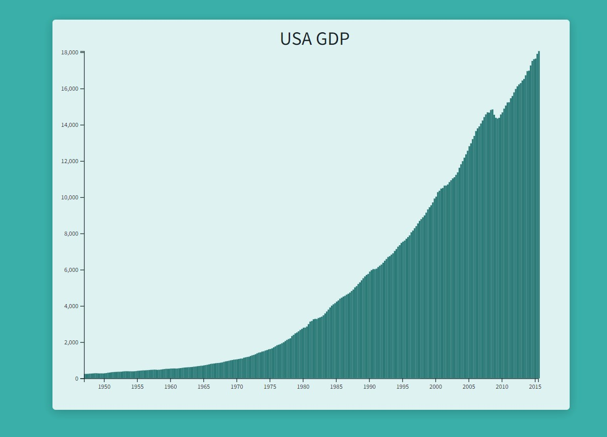

# Bar Chart
This repository contains code for creating a bar chart using D3.js and XMLHttpRequest. The code fetches data from a JSON file and generates a bar chart based on that data.

## Preview


## Prerequisites
To run the code in this repository, you need to have the following:
- A web browser that supports D3.js and XMLHttpRequest.
- D3.js library.

## Usage
Follow the instructions below to use the code:

1. Clone the repository or download the code files.

2. Include the D3.js library in your HTML file:

   ```html
   <script src="https://d3js.org/d3.v6.min.js"></script>
3. Open the HTML file that contains the code.

4. Find the following code snippet in the JavaScript section of the HTML file:
   ```html
   let url = "https://raw.githubusercontent.com/freeCodeCamp/ProjectReferenceData/master/GDP-data.json";
   let req = new XMLHttpRequest();
   // Rest of the code...
   ```
   Replace the url variable value with the URL of your JSON data file.

5. Run the HTML file in your web browser.

## Code Explanation
The code performs the following steps:
1. It defines variables and scales necessary for the chart.

2. It creates a function to draw the SVG canvas.

3. It creates a function to generate scales for the chart.

4. It creates a function to draw the bars of the chart.

5. It creates a function to generate the x-axis and y-axis of the chart.

6. It uses XMLHttpRequest to fetch the JSON data from the specified URL.

7. It parses the JSON data, extracts the values, and calls the necessary functions to draw the chart.

## Contributing
Contributions are welcome! If you encounter any issues or have suggestions for improvements, please feel free to open an issue or submit a pull request.

## Credits
This Bar Chart project is part of the [FreeCodeCamp Data Visualization Certification](https://www.freecodecamp.org/learn/data-visualization/) course. It was completed as one of the required projects in the curriculum.

Special thanks to freeCodeCamp for providing educational resources and coding challenges to help developers learn and improve their skills.
